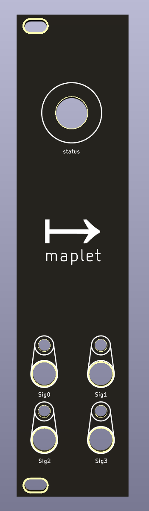

# Maplet

An ESP32 based eurorack module for libmapper connectivity.

## Why mappings in Eurorack?

Eurorack systems are excellent at making "generative music", where the system plays itself using sequencers, LFOs, clocks, and other modules. That said, there is lacking a method for "performative interaction" with Eurorack (asides from simply adjusting knobs directly on the system).

## Hardware

Maplet's front panel features a simple initial design.

## System Overview

The module uses an [UnexpectedMaker TinyPico](https://www.tinypico.com/) board based on the ESP32 chip as well as a MCP4728 digital-to-analog converter (DAC) as the main components.

